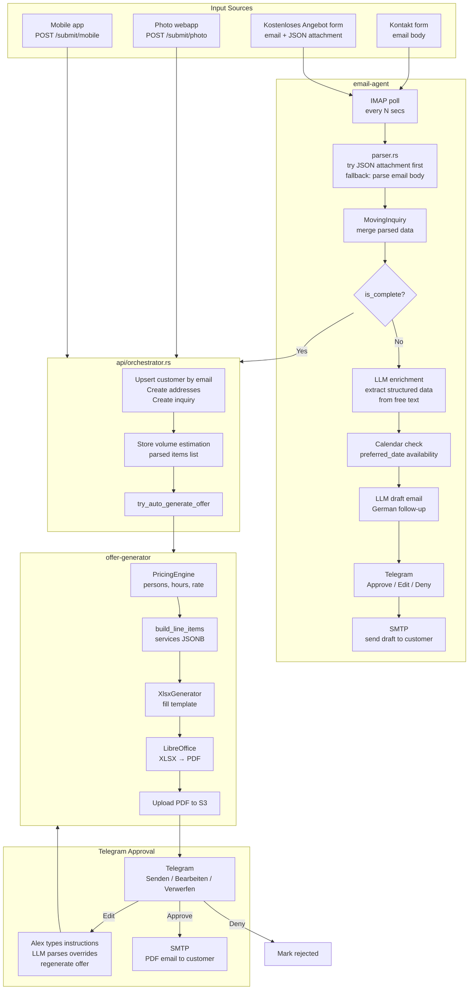
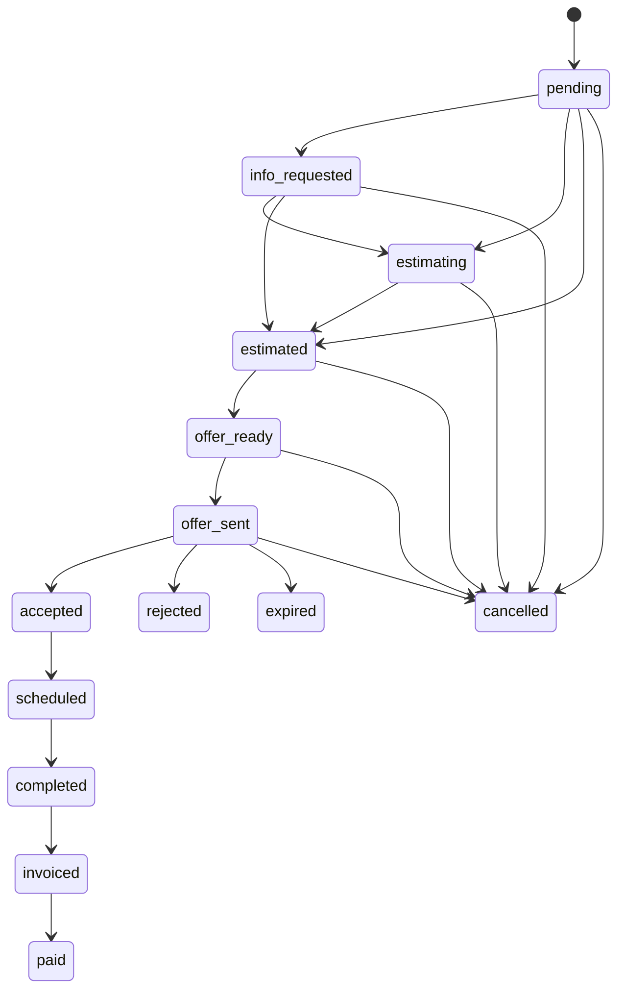

# Architecture — AUST Backend

> Agent map: read this before touching any pipeline code. For recurring failure patterns see [DEBUGGING.md](DEBUGGING.md).

---

## Crate Dependency Graph

```
src/main.rs
    │
    ├── crates/api          ← HTTP server (Axum), all routes, orchestrator
    │       ├── crates/core              ← domain models, config, errors (no deps)
    │       ├── crates/llm-providers     ← LLM abstraction (Claude / OpenAI / Ollama)
    │       ├── crates/storage           ← S3/local file storage abstraction
    │       ├── crates/calendar          ← booking + capacity management
    │       ├── crates/distance-calculator ← ORS geocoding + routing
    │       ├── crates/offer-generator   ← pricing engine, XLSX gen, PDF via LibreOffice
    │       └── crates/volume-estimator  ← LLM vision + ML service client
    │
    └── crates/email-agent  ← IMAP poller, email parser, Telegram approval loop
            ├── crates/core
            ├── crates/llm-providers
            └── crates/calendar          ← checks availability before drafting reply
```

`crates/core` is the only crate with zero internal dependencies. Every other crate depends on it.

---

## Full Pipeline: Email/Form → Offer → Customer



---

## Key Data Types Flowing Through the Pipeline

| Type | Crate | Role |
|------|-------|------|
| `MovingInquiry` | core/models/email.rs | Aggregated inquiry state from email parsing |
| `Services` | core/models/snapshots.rs | JSONB services flags on `inquiries` table |
| `InquiryResponse` | core/models/snapshots.rs | Canonical HTTP response for an inquiry |
| `EmployeeAssignmentSnapshot` | core/models/snapshots.rs | Employee assignment embedded in InquiryResponse |
| `PricingInput` / `PricingResult` | offer-generator/pricing.rs | Pricing calculation I/O |
| `OfferLineItem` | api/routes/offers.rs | One row in the XLSX offer |
| `DateAvailability` | calendar/models.rs | Availability + alternatives for a date |
| `RouteResult` | distance-calculator/route.rs | Geocoded route with km + duration |

---

## MovingInquiry: What `is_complete()` Requires

`email-agent/src/parser.rs` — an inquiry is forwarded to the orchestrator only when:
- `name` is `Some`
- `email` is `Some`
- `departure_address` is `Some`
- `arrival_address` is `Some`

Contact form submissions never satisfy this (no addresses) → they get the draft email path instead. Only "Kostenloses Angebot" form submissions (with JSON attachment) reach the orchestrator.

---

## Inquiry Status State Machine



Transitions enforced by `InquiryStatus::can_transition_to()` in `crates/core/src/models/inquiry.rs`.

---

## Two Separate Hours Systems

These are **independent** — they do NOT share data:

| System | Stored in | Source | Purpose |
|--------|-----------|--------|---------|
| Offer hours | `offers` table (`result_data`) | `PricingEngine::calculate()` formula | Customer pricing, PDF content |
| Payroll hours | `inquiry_employees` table (`planned_hours`, `actual_hours`) | Manual input in admin UI | Accounting / payroll tracking |

The offer PricingEngine formula: `hours = ceil(volume_m3 / (persons × 2.0))`

The assign-employee modal defaults `planned_hours` to `0` — the admin fills it in.

---

## Offer XLSX Template Layout

Template file: `templates/Angebot_Vorlage.xlsx` (embedded at compile time in `offer-generator`).

```
Sheet "Tabelle1":
  A8-A11   Customer address block (salutation, name, street, city)
  G14      Date (replaces TODAY() formula)
  A16      Title: "Unverbindlicher Kostenvoranschlag {number}"
  B17      Moving date
  A26-A28  Origin address (street, city, floor)
  F26-F28  Destination address (street, city, floor)
  A29      "Umzugspauschale X.X m³"
  J50      Number of persons (referenced by G38 formula)

  Line items (rows 31-42, generator hides ALL then reveals active):
    First:  Fahrkostenpauschale (always, flat ORS round-trip amount)
    Then:   Demontage (if disassembly), Montage (if assembly)
            Halteverbotszone (1-2 count)
            Umzugsmaterial (if packing)
            Manual overrides (Möbellift, Kartons, etc.)
    Labor:  N Umzugshelfer (is_labor=true, G38 = E38 × F38 × J50)
    Last:   Nürnbergerversicherung (qty=1, price=0, decorative)

  G44      Netto total (SUM G31:G42)

Sheet "Erfasste Gegenstände" (added only when items list is non-empty):
  Item name, volume m³, dimensions, confidence
```

---

## External Service Dependencies

| Service | Crate | Config key | Notes |
|---------|-------|-----------|-------|
| OpenRouteService | distance-calculator | `AUST__MAPS__API_KEY` | Geocode + routing. 40 req/min free. Must send `Accept: application/geo+json;charset=UTF-8` for directions or get 406. |
| Claude / OpenAI / Ollama | llm-providers | `AUST__LLM__*` | German language → use Claude as primary |
| S3 / MinIO | storage | `AUST__STORAGE__*` | PDF + image storage |
| IMAP / SMTP | email-agent | `AUST__EMAIL__*` | lettre + async-imap |
| Telegram Bot API | email-agent | `AUST__TELEGRAM__*` | Long-polling `/getUpdates`. Only one instance must poll or conflicts occur. |
| ML Vision (Modal) | volume-estimator | `AUST__VISION_SERVICE__*` | GPU inference, ~3-10s/image. Disabled by default. |
| LibreOffice | offer-generator | (system binary) | `soffice --headless --convert-to pdf`. Falls back to XLSX if missing. |
| PostgreSQL | all (via api) | `AUST__DATABASE__URL` | SQLx compile-time checked queries |
